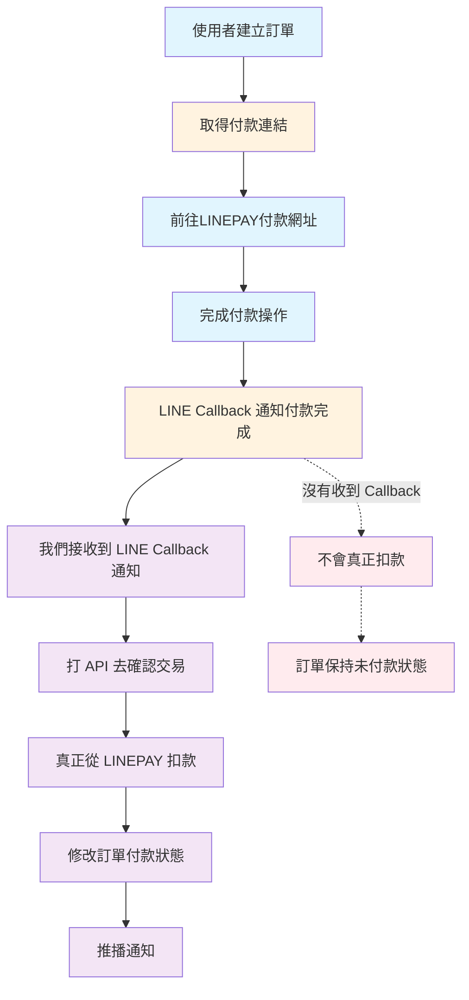

# LINEPAY 付款與扣款流程圖

## 流程說明

### 正常付款流程
1. **使用者建立訂單** → 系統產生訂單並取得 LINEPAY 付款連結
2. **前往LINEPAY付款網址** → 使用者點擊付款連結，導向 LINEPAY 付款頁面
3. **完成付款操作** → 使用者在 LINEPAY 頁面完成付款動作
4. **LINE Callback 通知** → LINEPAY 系統發送付款完成通知給我們的系統
5. **接收 Callback 通知** → 我們的系統接收並處理 LINEPAY 的回調通知
6. **確認交易** → 調用 LINEPAY API 確認交易狀態
7. **真正扣款** → 此時才會從 LINEPAY 真正扣款
8. **更新訂單狀態** → 修改訂單付款狀態為已付款
9. **推播通知** → 發送付款成功通知給使用者

### 重要注意事項
⚠️ **關鍵點**：只有當我們收到 LINE Callback 通知並成功確認交易後，才會真正從 LINEPAY 扣款。

❌ **異常情況**：如果沒有收到 LINE Callback 通知，即使使用者完成了付款操作，也不會真正扣款，訂單將保持未付款狀態。

### 流程顏色說明
- 🔵 **藍色**：使用者操作
- 🟠 **橘色**：LINEPAY 系統操作
- 🟣 **紫色**：我們系統內部操作
- 🔴 **紅色**：異常處理流程
